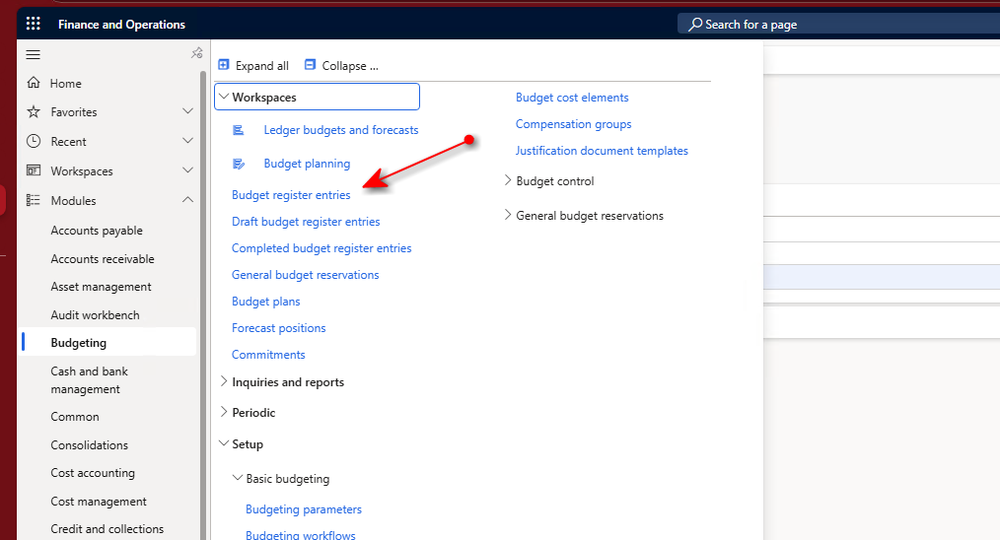
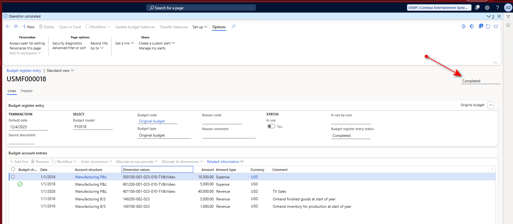

---
lab:
  title: 'ラボ 4:予算登録エントリを作成して承認する'
  module: 'Module 7: Describe expense management, fixed asset management, and budgeting'
---

# モジュール 7:経費管理、固定資産管理、予算作成について説明する

## ラボ 4:予算登録エントリを作成して承認する

## 目標

このラボでは、予算登録エントリを作成し、承認します。 その後、予算対実績のレポートを実行します。 2018 年 1 月の法人 USMF を基に作業します。これは、予算エントリと比較する、この期間の "実績" データが含まれているためです。

## ラボのセットアップ

- **推定時間**:20 分間

## タスク

1.  **ナビゲーション** ウィンドウで、**[モジュール]** \> **[予算作成]** \> **[予算登録エントリ]** を選択します。

2.  アクション ペインで**新規**を選択します。
3.  **[予算モデル]** ドロップダウン リストで **[FY2018]** を選択します。

![[FY2018] が選択されている予算モデルのスクリーンショット。](./Media/5a2583bfa6060be2e5bee0085e16c5c1.png)

4.  **[予算コード]** ドロップダウン リストで **[元の予算]** を選択します。

![[元の予算] が選択されているスクリーンショット。](./Media/fa0bc3673134ac3b6131f5a7b18293ae.png)

5.  **[予算勘定項目]** クイック タブの **[行の追加]** メニュー項目を選択します。
6.  次のエントリを追加します。

| 日付     | 勘定構造 | ディメンション値            | 量    | 金額のタイプ | 通貨 | コメント                                          |
|----------|-------------------|-----------------------------|-----------|-------------|----------|--------------------------------------------------|
| 2018 年 1 月 1 日 | 製造 B/S | 140100-002-023              | 1,000.00  | 経費     | 米国ドル      | 年初の生産用の手持在庫 |
| 2018 年 1 月 1 日 | 製造 B/S | 140200-002-023              | 5,000.00  | 経費     | 米国ドル      | 年初の直販完成品           |
| 2018 年 1 月 1 日 | 製造 P/L | 401100-001-023-010-TV&Video | 40,000.00 | Revenue     | 米国ドル      | テレビの売上                                         |
| 2018 年 1 月 1 日 | 製造 P/L | 601200-001-023-010-TV&Video | 5,000.00  | 経費     | 米国ドル      |                                                  |
| 2018 年 1 月 1 日 | 製造 P/L | 500100-001-023-010-TV&Video | 10,500.00 | 経費     | 米国ドル      |                                                  |

7.  ページ上部の [アクション] ペインで **[予算残高を更新する]** を選択します。 既定値のままにして、**[更新]** を選択します。 **[操作が完了しました]** というメッセージが表示されます。 これらの予算エントリはドラフト モードではなくなり、2018 年 1 月の予算と見なされます。 ページの右上にある状態が **[完了]** に変更されていることに注目してください。

8.  **ナビゲーション** ウィンドウで、**[モジュール]** \> **[予算作成]** \> **[照会およびレポート]** \> **[基本予算作成]** \> **[実績対予算]** を選択します。

![[実績対予算] ナビゲーション オプションのスクリーンショット。](./Media/384ff5c2808c13b8de46ed662573bf90.png)

9.  **[財務分析コード セット]** の **[MA+BU+DEPT+CC]** を選択します。

![財務分析コード セットとして [MA+BU+DEPT+CC] が選択されているスクリーンショット。](./Media/73abe92b14b69ace03abcb611a37007f.png)

10.  **[予算モデル]** で **[FY2018]** を選択します。
11.  **[開始日]** に **[1/1/2018]** を選択し **[終了日]** として **[1/31/2018]** を選択します。
12.  他のフィールドは既定値のままにして、[アクション] ペインで **[パラメーターを適用する]** を選択します。
13.  レポートを確認します。 予算行を入力しなかった実績が 2 つの勘定に含まれていたことに注目してください。 これらの勘定の予算列は 0 です。 予算を入力した勘定が、[予算] 列に表示され、入力した金額が表示されます。

### まとめ

その年の完全な予算を入力すると、会計年度の各期間の値が含まれます。 1 年間を通して、予算対実績のレポートを実行して、実績が予算とどの程度一致するかを調べることができます。 一致しない場合は、予算を更新するか、または経費を削減するか収益を上げて実績を調整する必要があります。 予算対実績のレポートには、差異の分析を開始するための概要ビューが表示されます。 予算を作成し、予算対実績のレポートを定期的に実行することで、会社は会計年度全体を通して追跡を行い、予算と実績が予想に合うように予算数値やプロセスを調整できます。

